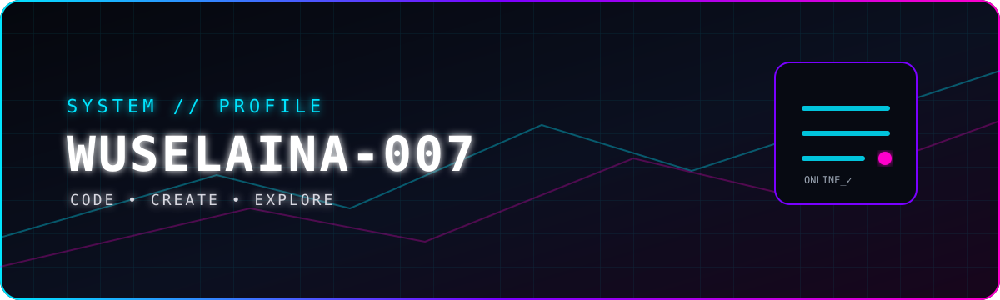

<div align="center">



<br><br>


<br>


</div>

---

## `> WHOAMI`

```text
╭──────────────────────────────────────────────────────────────╮
│ USER       :: Wuselaina-007                                 │
│ STATUS     :: ONLINE                                         │
│ MODE       :: BUILD / EXPLORE / BREAK / FIX                 │
│ INTERESTS  :: AI • Coding • Minecraft • Game Modding       │
│             :: Automation • Web • Localization              │
│ CURRENT    :: Learning • Experimenting • Building           │
╰──────────────────────────────────────────────────────────────╯
```

> I like turning ideas into things that actually work.
> Sometimes I build software. Sometimes I build games.
> Sometimes I break everything and figure out why. 🧪

---

## `> TECH_STACK`

<div align="center">


</div>

---

## `> CURRENTLY_EXPLORING`

```text
[██████████████████░░] AI / LLM / Agents
[████████████████░░░░] Web Development
[███████████████░░░░░] Game Development
[██████████████░░░░░░] Automation
[████████████░░░░░░░░] Localization
```

---

## `> PROJECTS`

<div align="center">

<a href="https://github.com/WusElaina-007?tab=repositories">

</a>

</div>

### 🎮 Game Development

Building and experimenting with:

- Game systems
- Modding tools
- Localization pipelines
- Developer utilities
- Experimental gameplay mechanics

### 🤖 AI / Automation

Exploring:

- LLM APIs
- AI developer tools
- Model experimentation
- Workflow automation
- Local / browser-based AI

---

## `> GITHUB_STATS`

<div align="center">


</div>

---

## `> ACTIVITY_GRAPH`

<div align="center">

<a href="https://github.com/WusElaina-007">

</a>

</div>

---

## `> TROPHIES`

<div align="center">


</div>

---

## `> CONTRIBUTION_MATRIX`

<div align="center">

<picture>
  <source media="(prefers-color-scheme: dark)" srcset="https://raw.githubusercontent.com/WusElaina-007/Wuselaina-007/output/github-snake-dark.svg" />
  <source media="(prefers-color-scheme: light)" srcset="https://raw.githubusercontent.com/WusElaina-007/Wuselaina-007/output/github-snake.svg" />
  
</picture>

</div>

---

## `> TERMINAL`

```bash
$ whoami
Wuselaina-007

$ ./wuselaina --status
[+] system     : ONLINE
[+] coding     : ACTIVE
[+] creativity : ENABLED
[+] curiosity  : 100%
[+] bugs       : MANY

$ ./wuselaina --next-project
> scanning ideas...
> analyzing possibilities...
> creating something interesting...

[████████████████████████████████] 100%
> PROJECT INITIALIZED ✓
```

---

## `> CONNECT`

<div align="center">

<a href="https://github.com/WusElaina-007">

</a>

<a href="https://github.com/WusElaina-007?tab=repositories">

</a>

</div>

---

<div align="center">

```text
╔══════════════════════════════════════════════════════╗
║                                                      ║
║          BUILD • BREAK • LEARN • REPEAT              ║
║                                                      ║
╚══════════════════════════════════════════════════════╝
```


</div>
